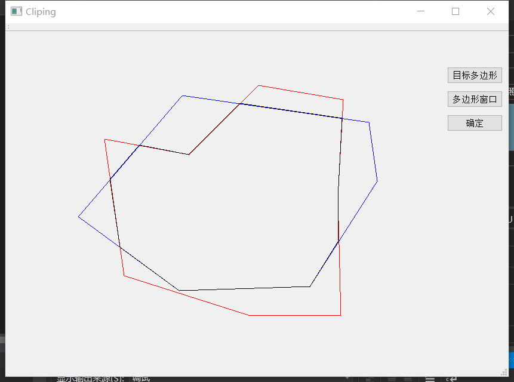
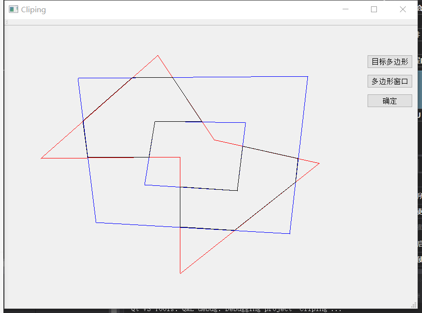
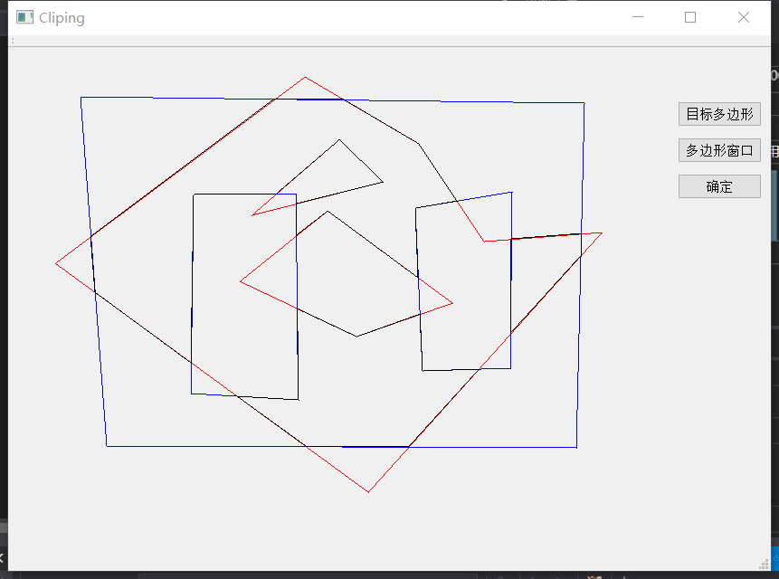
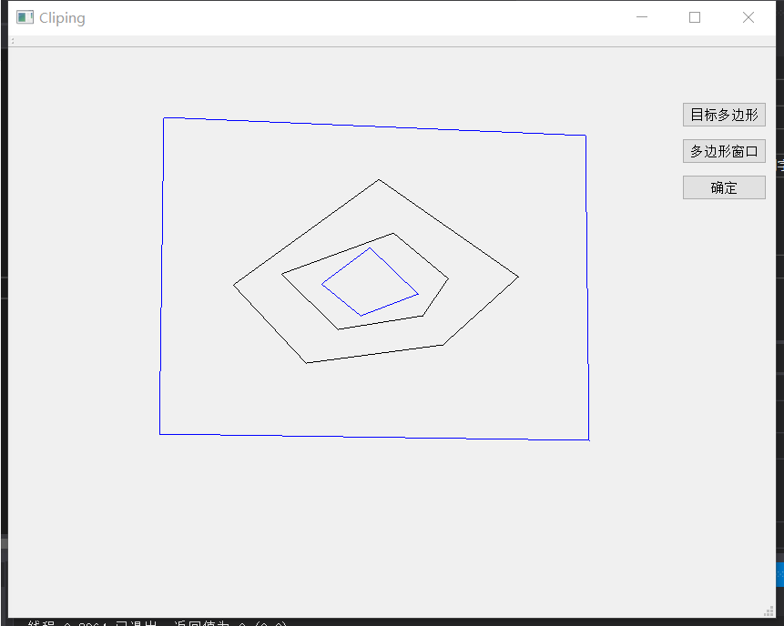
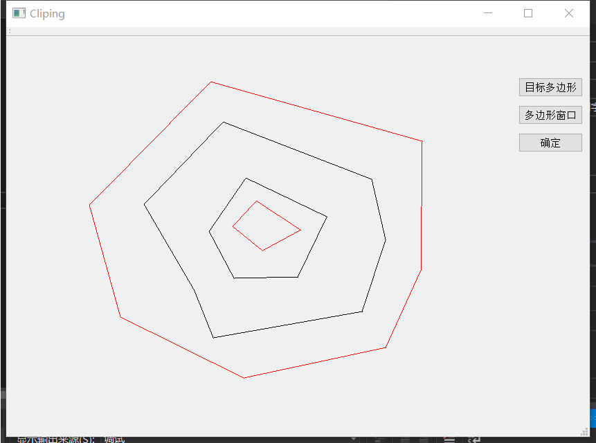

# 图形学第一次作业报告

软73 沈冠霖 2017013569

## 1.使用方法

**运行环境：**

- Windows10
- VS2017
- QT5.9

**运行方法：**

- 左键点击选择点，右键点击闭合多边形
- 选择右面的”目标多边形“，可以绘制红色的待裁剪多边形
- 选择右面的“窗口多边形”，可以绘制蓝色的窗口多边形
- 输入完毕后点击“确定”，可以绘制黑色的裁剪结果

**输入要求：**

- 目标多边形和窗口多边形可以是任意多边形，可以带一个和多个内环
- 但是多边形自身的边不能相交
- 内环之间、内环和外环不能相交
- 不支持内环套内环的情况
- 不支持空多边形或者只有2条边的情况
- 非法输入可能产生异常结果，因为时间原因我没有进行非法输入处理

## 2.算法介绍

这次作业我以Weiler_Atherton算法作为框架，具体分为几个步骤

### 2.1.多边形读入

多边形读入的主要问题有两个，一是判断多边形哪个是外环，二是判断多边形是顺时针还是逆时针。

判断多边形哪个是外环的方法很简单，只需要判断每个多边形的第一个顶点是否在其他多边形内就可以了。我使用夹角法判断点和多边形的内外关系---如果夹角和的绝对值是2pi，就是在内部，否则是外部。

判断多边形顺逆时针我使用了[曲线积分法](https://www.cnblogs.com/kyokuhuang/p/4250526.html)，沿着多边形做曲线积分，
$$
\oint -ydx = \sum_{i=0}^{n-1} -0.5 * (y_{i+1} + y_{i})(x_{i+1}-x_{i})
$$
如果结果为正，就是逆时针（正方向），否则是顺时针。

### 2.2.求交与排序

进行Weiler Atherton算法的第一步是[线段求交](https://zhuanlan.zhihu.com/p/134250505)。
$$
先求线段所在的直线方程和直线交点\\
根据ax+by+c=0,计算出a = y_2-y_1, b=x_2-x_1,c=x_2y_1-x_1y_2,\\
有交点x=\frac{c_2b_1-c_1b_2}{a_1b_2-a_2b_1}, y= \frac{c_1a_2-c_2a_1}{a_1b_2-a_2b_1},若分母=0则共线无交点\\
然后判断交点是否是线段相交：如果交点的x，y坐标都在两个线段范围内，则是合理的交点。
$$
之后可以利用交点的k
$$
a_{start} + k(a_{end} - a_{start}) = p
$$
来对交点排序

### 2.3.主算法

我们使用的是Weiler Atherton算法，在两个表间不断跟踪，直到不存在未被跟踪的点为止。具体流程同课件。

### 2.4.特殊判断

有的多边形没有交点，算法并不能处理这部分，因此我对没有交点的多边形进行特殊判断：

- 目标多边形在窗口外环内，而且不在任何窗口内环内，就需要加入结果
- 窗口多边形在目标外环内，而且不在任何目标内环内，就需要加入结果

## 3.结果

最简单的情况：

课件的情况（有内环）

设计的复杂情况（多个内环）

特判1：窗口外环-多边形外环-多边形内环-窗口内环-，我们正确的把多边形外环和内环标记上了

特判2：套环--多边形外环-窗口外环-窗口内环-多边形内环，我正确的将窗口外环和内环标记上了

## 4.总结

首先，这个工程仍然有改进空间，一方面可以加入非法输入的判断和异常处理，另一方面可以改进交互界面UI，但是因为时间原因没有完成。

其次，我体会到了图形学编程的困难：底层模块大量复用，而且难以debug。这就需要我们做好底层模块（求交，判断内外关系等）的单元测试，以及发挥平面和空间想象力构造测试数据。

还有改进空间：时间原因没有处理不合法输入，显示效果也不是很完美